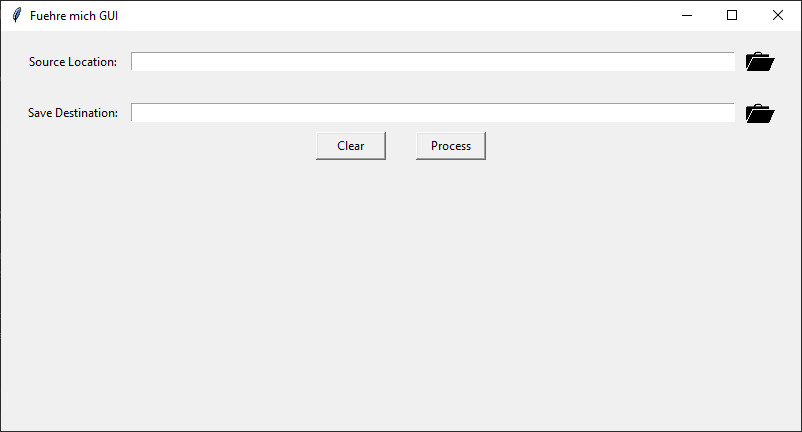
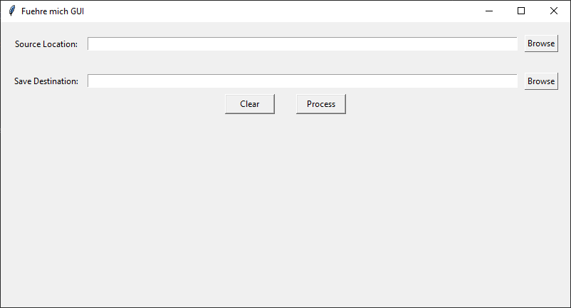

# Fuehre mich Readme

## Usage

As usual. Can use as cli programm or with gui by open without adding argument's.

## Prefix

By default in the gui a prefix is added at the end of the filename.
Default is "_fixed".
It can be changed in the python file. Search for prefix.

## Look

Add folder-open.png into the same folder as the python file.

#### With Folder.png

#### Without Folder.png

